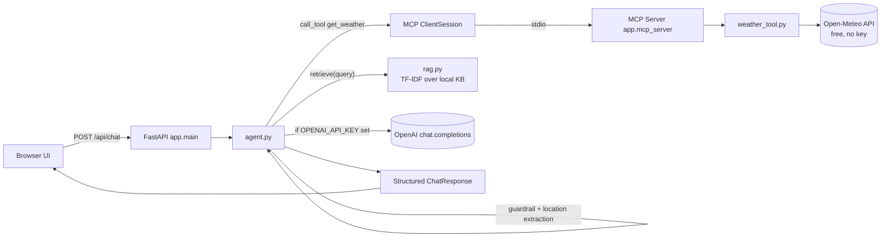

# SkyBot — MCP-powered Weather Chatbot

A domain-restricted weather/temperature chatbot: FastAPI backend, a real
**MCP (Model Context Protocol) server** exposing a weather tool, a small
**RAG** knowledge base for weather concepts, an optional LLM generation
step, topic guardrails, and a browser chat UI. Runs entirely on free
services (no paid API keys required).

## Architecture



**Why this satisfies each requirement:**

- **MCP**: `app/mcp_server.py` is a standalone MCP server (built with the
  official `mcp` SDK's `FastMCP`) exposing one tool, `get_weather`. FastAPI
  never calls the weather API directly — it always goes through an MCP
  `ClientSession` (`app/mcp_client.py`) talking to that server over stdio,
  the same protocol Claude Desktop or any MCP host would use.
- **Generative AI**: `agent.py` optionally calls an LLM (OpenAI-compatible
  `chat.completions`) to turn the tool's structured data + a retrieved
  knowledge snippet into a natural-language answer. If no key is set, a
  deterministic template produces the same structured answer — the app
  still works, still free.
- **FastAPI**: `app/main.py` — a single `/api/chat` endpoint plus a static
  UI, with the MCP client lifecycle managed via FastAPI's `lifespan`.
- **Required tool**: the weather/geocoding tool (`weather_tool.py`,
  wrapped as the MCP tool `get_weather`), backed by Open-Meteo — free,
  keyless, global coverage.
- **Refuses other topics**: `agent.is_weather_query()` is a guardrail that
  runs before anything else; non-weather messages get a fixed
  `out_of_scope` response and never reach the tool or the LLM.
- **RAG**: `rag.py` holds a small curated knowledge base of weather
  concepts (humidity, dew point, UV index, WMO codes, etc.) indexed with
  TF-IDF/cosine similarity (`scikit-learn`) — retrieved and blended into
  the answer when relevant.
- **Consistent structure**: every response is a `ChatResponse` Pydantic
  model (`status`, `reply`, `weather`, `knowledge_snippet`, `source`) —
  same shape whether the query succeeded, was out of scope, or failed.
- **UI**: `static/index.html` + `chat.js` — a minimal, dependency-free chat
  interface with a structured weather card.
- **Zero-cost, globally reachable**: see deployment options below — all
  have permanent free tiers and give you a public HTTPS URL/domain.

## Run locally

```bash
cd weather-mcp-bot
python -m venv .venv && source .venv/bin/activate   # Windows: .venv\Scripts\activate
pip install -r requirements.txt
cp .env.example .env      # optionally add OPENAI_API_KEY — not required
uvicorn app.main:app --reload
```

Open http://localhost:8000 — try "What's the weather in Tokyo?" or
"How humid is it in Mumbai right now?". Ask something unrelated (e.g.
"write me a poem") and it will politely refuse.

You can also test the MCP server on its own with the official inspector:

```bash
mcp dev app/mcp_server.py
```

## Deploy for free, on a public domain

Pick any one of these — all are genuinely free and give a public URL
reachable from anywhere:

### Option A — Hugging Face Spaces (Docker SDK) — easiest
1. Create a new Space → SDK: **Docker** → visibility: Public.
2. Push this folder's contents to the Space's git repo (it already
   contains a `Dockerfile` listening on port 7860, which Spaces expects).
3. (Optional) In Space Settings → "Repository secrets", add
   `OPENAI_API_KEY` if you want LLM-generated replies.
4. Your bot is live at `https://<you>-<space-name>.hf.space` — free
   forever on the CPU-basic tier.

### Option B — Render.com free Web Service
1. Push this repo to GitHub.
2. New → "Blueprint" on Render, point it at the repo (it will read
   `render.yaml`), or manually create a "Web Service" with
   Environment = Docker.
3. Free plan: gets a `https://weather-mcp-bot.onrender.com` URL. Free
   services sleep after ~15 minutes idle and wake on the next request
   (~30s cold start) — fine for a demo/portfolio bot at zero cost.

### Option C — Fly.io free allowance
```bash
fly launch --no-deploy   # picks up the Dockerfile
fly deploy
```
Fly's free allowance covers a couple of small always-on VMs, giving you
`https://<app>.fly.dev`.

All three give you HTTPS + a public domain + zero cost. Custom domains
(e.g. `weather.yourdomain.com`) can be pointed at any of them for free
via a CNAME, if you own a domain — the *hosting* itself remains free
either way.

## Project layout

```
app/
  agent.py         # guardrail, location extraction, RAG + LLM orchestration
  mcp_server.py     # MCP server exposing the get_weather tool
  mcp_client.py     # long-lived MCP ClientSession used by FastAPI
  weather_tool.py   # Open-Meteo geocoding + current-weather client
  rag.py            # local TF-IDF knowledge base + retrieval
  schemas.py        # Pydantic request/response models (consistent shape)
  config.py         # env-based config, all optional except nothing
  main.py           # FastAPI app + lifespan + static UI mount
static/
  index.html, style.css, chat.js   # chat UI
Dockerfile           # works for HF Spaces / Render / Fly
render.yaml           # Render free-tier blueprint
```

## Notes & limits

- Open-Meteo's free tier is generous for personal/demo traffic but not
  meant for heavy commercial load — fine for this use case.
- The LLM step is fully optional; leaving `OPENAI_API_KEY` blank keeps
  the entire stack at $0, including hosting.
- The guardrail is keyword-based for speed and zero cost; swap in an
  LLM-based classifier in `agent.is_weather_query()` if you want fuzzier
  topic detection once you have an LLM key configured anyway.
